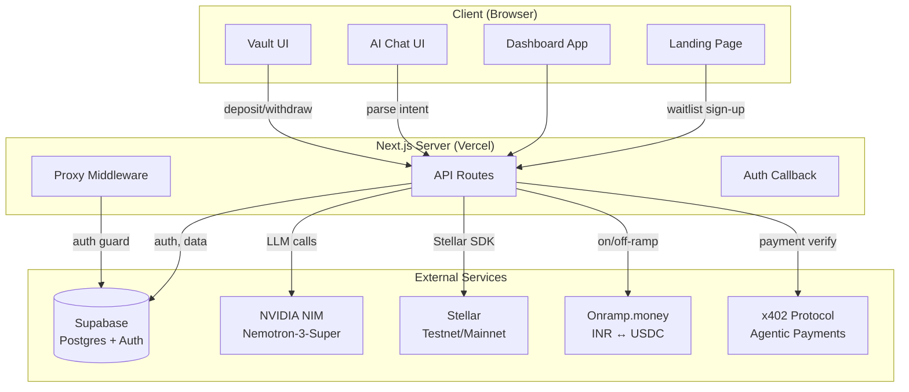

# System Architecture

## High-Level Overview



---

## Data Flow: AI-Driven Payment Allocation

```
Stellar payment arrives (USDC)
        │
        ▼
POST /api/ai/propose
  ├── Read allocation_rules from Supabase
  ├── Read upcoming bills (due date priority)
  └── Compute line items per bucket
        │
        ▼
AgentProposal (never touches funds)
        │
        ▼
User sees AgentDecisionPanel ──► Dismiss
        │
     Approve
        │
        ▼
POST /api/ai/approve
        │
  ┌─────┼──────────────┐
  ▼     ▼              ▼
Bills  Family       Savings
(x402) (Onramp)    (Soroban vault)
  │     │              │
  └─────┴──────────────┘
        │
agent_decision_items written to DB
```

---

## Database Schema

```
auth.users (Supabase managed)
    │
    ├── waitlist
    │     id, email, created_at
    │
    ├── bills
    │     id, user_id, name, payee, amount, currency, frequency,
    │     next_due_date, is_autopay_enabled, ...
    │
    ├── family_recipients
    │     id, user_id, name, payee_identifier, monthly_allowance, ...
    │
    ├── allocation_rules
    │     id, user_id, name, allocations (JSONB), is_active, ...
    │
    ├── agent_decisions
    │     id, user_id, status, total_usdc, proposal_json, ...
    │
    ├── agent_decision_items
    │     id, decision_id, bucket, amount_usdc, status, tx_hash, ...
    │
    ├── vault_positions
    │     id, user_id, amount_usdc, strategy, apy_percent,
    │     status, tx_hash, withdrawn_at, ...
    │
    └── x402_nonces
          nonce, used_at
```

---

## API Routes Reference

| Method | Route | Description |
|--------|-------|-------------|
| POST | `/api/waitlist` | Join waitlist |
| POST | `/api/ai/parse-intent` | NL → ParsedIntent via NVIDIA NIM |
| POST | `/api/ai/propose` | Generate allocation proposal |
| POST | `/api/ai/approve` | Execute approved proposal |
| POST | `/api/ai/apply-rule` | Save allocation rule |
| GET | `/api/ai/decisions` | List agent decisions |
| POST | `/api/vault/deposit` | Deposit to Soroban vault |
| POST | `/api/vault/withdraw` | Withdraw from vault position |
| GET | `/api/vault/positions` | List user vault positions |
| GET | `/api/stellar/account` | Fetch testnet account info |
| GET | `/api/stellar/payments` | Fetch recent payment events |
| GET | `/api/stellar/stream` | SSE stream of live payments |
| POST | `/api/x402/pay-bill` | Pay a bill via x402 protocol |
| POST | `/api/onramp/convert` | Convert USDC → INR via Onramp |
| POST | `/api/onramp/webhook` | Onramp payment status webhook |

---

## Key Design Decisions

1. **LLM never executes payments.** The AI only proposes. All executions require a separate human-approved `POST /api/ai/approve` call.

2. **Stubs everywhere in Phase 5.** All financial APIs (x402, Onramp, Soroban) use realistic stub implementations so the app is fully usable on testnet without real money.

3. **Row Level Security.** All Supabase tables have RLS enabled. Users can only access their own data.

4. **Turborepo monorepo.** Shared packages (`@delitex/ui`, `@delitex/config-*`) live in `/packages`. The main app lives in `/apps/web`.

5. **Environment parity.** CI uses identical dummy env vars to ensure the build fails fast if code incorrectly assumes env var presence at build time.
